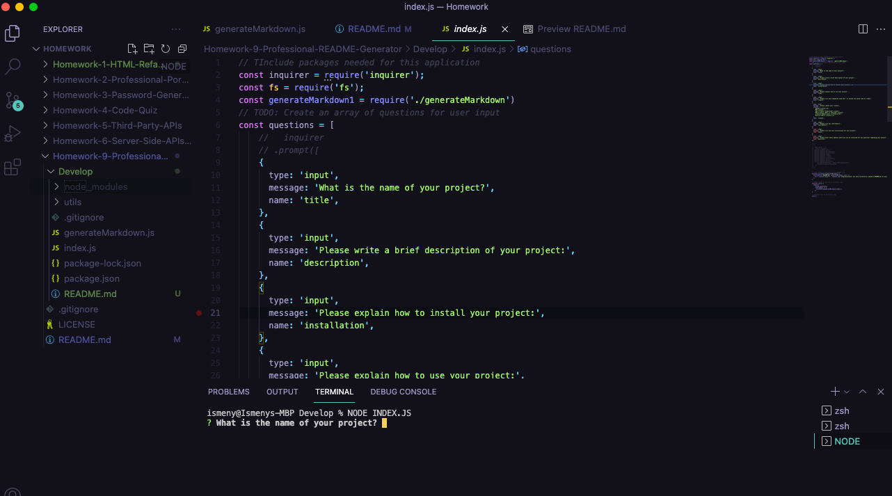

# Homework-9-Professional-README-Generator

## Description
The purpose of this project is to generate a README.md after the user is prompted with a series of questions that make up the contents of a proffesional README.md. This project is built using Node.js and is initialized in the integrated terminal in Visual Studio Code. 

## Table of contents
  - [Installation](#installation)
  - [Usage](#usage)
  - [Credits](#credits)
  - [License](#license)
  - [Test](#test)
  - [Questions](#questions)
  

## Installation
Video link  : ***https://watch.screencastify.com/v/Q3jKwmKSCBJaAoN5M769***

## Usage
Open terminal and run command line "node index.js". You will then be prompted with a series of questions asking for user input. After all questions are answered the user will receive a message letting them knkow that the README.md has been created. The user input is then taken and used to quickly create a professional README.md. for a new project. 

## Credits
Uses the Inquierer Package  
Received help from: 
* Jayla De'nae - peer
* Damien Luzzo - peer 
* Stephanie Cortez - peer
* Ethan Cho - peer

## License
MIT Licensce

## Contributions
n/a
## Test
n/a
## Questions
Github: Ismeny Saguilan - https://github.com/Ismeny  
Email: menysag2@gmail.com